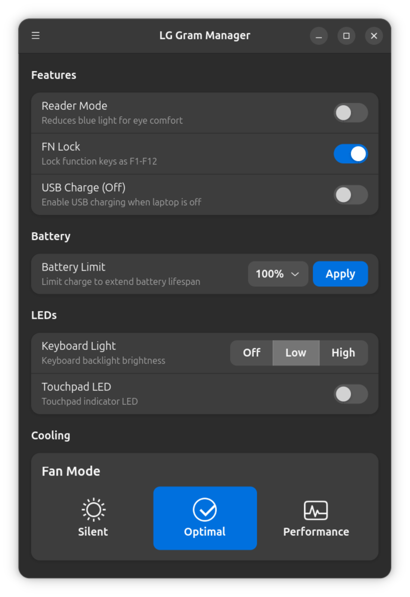

# LG Gram Manager

GTK4 application for managing LG Gram laptop features on Linux.



## Features

- Reader mode (blue light filter)
- FN lock toggle
- Fan mode (optimal, silent, performance)
- USB charging when powered off
- Battery care (80% charge limit)
- Keyboard backlight control
- Touchpad LED control

## Hotkeys

Settings changed with the Fn keys (keyboard backlight, fan mode, reader mode, FN lock, touchpad) are picked up by the app automatically.

The driver reports Fn-F1 (the LG control panel key) as F15. Bind F15 to `lg-gram-manager` in your desktop's keyboard settings to open the app with a key press.

## Requirements

- LG Gram laptop with the `lg-laptop` kernel module
- Linux kernel 6.2+ (kernel 6.17+ required for Performance fan mode)
- GTK4 and libadwaita
- Python 3.8+

## Installation

Packages for both Debian/Ubuntu and Arch-based distros are on the
[releases page](https://github.com/bryfur/lg-gram-manager/releases).

Debian / Ubuntu:

```bash
sudo dpkg -i lg-gram-manager_*_all.deb
```

Arch / CachyOS / EndeavourOS:

```bash
sudo pacman -U lg-gram-manager-*-any.pkg.tar.zst
sudo usermod -aG lg-gram $USER
```

During installation, your user will be added to the `lg-gram` group, which grants permission to modify laptop settings without requiring a password each time. A system restart may be required for this change to take effect.

Or run from source:

```bash
python3 lg_gram_manager_gtk.py
```

Note: Running from source without installing the package will prompt for authentication when changing settings.

## Building

```bash
./build.sh
```

The .deb package will be output to `dist/`.

## Troubleshooting

If the driver is not loaded:

```bash
sudo modprobe lg-laptop
```

To load on boot:

```bash
echo "lg-laptop" | sudo tee -a /etc/modules
```
